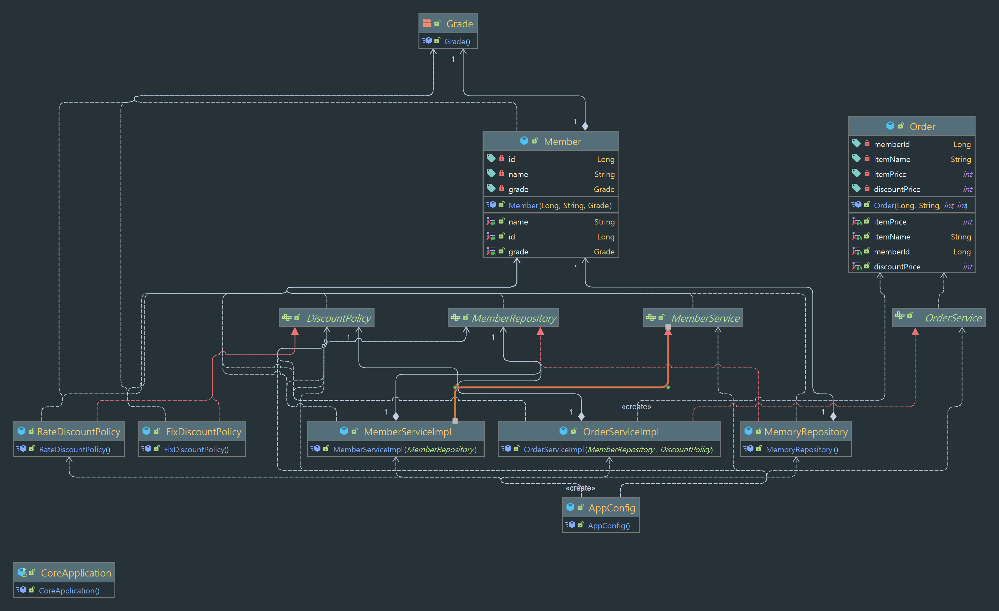

# second-hello-spring
스프링 핵심 원리 - 기본편 (인프런)

# 2021
## 12월
### 2021 - 12 - 12
#### [1. 스프링을 하기전에 다형성을 알아보자](https://github.com/Imaspear/WhatIsSpring/blob/main/2021/12월/12일/스프링을_하기_전에_다형성을_알아보자.md)

<br>

#### [2. 스프링에서 좋은 객체 지향 설계의 5가지 원칙(SOLID)](https://github.com/Imaspear/WhatIsSpring/blob/main/2021/12월/12일/스프링에서_좋은_객체_지향_설계의_5가지_원칙(SOLID).md)

<br>

#### [3. 좋은 객체 지향 설계에 대한 나의 고민](https://github.com/Imaspear/WhatIsSpring/blob/main/2021/12월/12일/좋은_객체_지향_설계에_대한_나의_고민.md)

<br>
<br>

### 2021 - 12 - 13
#### 테스트
> 테스트는 성공과 실패 그리고 예외까지 테스트해보자.

> BeforeEach -> test code -> AfterEach 메서드의 사이클 

#### 나는 SRP, DIP, OCP 원칙에 어긋나는 설계를 하고 있다.
> 인터페이스를 이용해 역할과 기능을 분리했는데... 

이전까지 우리는 클라이언트 클래스가 생성될 때 마다 구현 객체를 참조해 생성자를 생성해주며 다양한 메서드를 실행했다.

인터페이스를 통해 우리는 인터페이스에 있는 메서드를 참조해 사용할 수 있어서 실제 동작에 필요한 구현 객체가 아무리 변해도 우리는
클라이언트의 코드를 크게 변경 시켜줄 필요가 없는 상황이다. 하지만 동작에 필요한 구현 객체를 바꿔야 하는 상황이 온다면 우리는
필수 불가결하게 클라이언트 코드를 변경해줘야 한다. 

 ```java
public class MemberServiceImpl implements MemberService{
    private final MemberRepository memberRepository = new MemoryRepository();
//    다양한 메서드...
}
 ```

우리가 상당한 클라이언트 코드들을 가지고 있고, 바꿔야 하는 구현 객체를 참조하는 클라이언트 코드들이 많다면, 
클라이언트 코드들을 다 수정해야하는 상황이 온다. 😖😖 

마지막으로 우리가 추구하는 객체 지향 프로그래밍에서 세가지의 원칙을 어기고 있다.
우리가 어긴 세가지 원칙은 SRP, DIP 그리고 OCP이다.
1. SRP 원칙에 어긋남
   
   > 해당 클라이언트 코드는 구현 객체를 참조해야 하고, 실행하는 역할까지 두 개의 책임을 맡은 클라이언트 코드가 된다.
2. DIP 원칙에 어긋남
   
   > 인터페이스를 의존하고 있지만 인터페이스로 구현한 객체까지도 의존하고 있는 상황이 된다.
3. OCP 원칙에 어긋남 
   
   > 변경에는 닫혀 있어야 하는 OCP 원칙에 어긋난다. 


클라이언트 코드를 어떻게 바꿔야 하는가?
>스프링의 장점인 의존관계 주입을 해보자!


#### AppConfig 클래스의 출현
> AppConfig 클래스가 우리에게 어떤 편리함을 제공해 줄까?

AppConfig 클래스는 애플리케이션의 실제 동작에 필요한 구현 객체를 생성하고, 생성한 객체 인스턴스의 참조(레퍼런스)를 생성자를 통해서 주입(연결) 해준다.
생성자 주입을 하기 위해서는 구현 객체에서 생성자를 생성해 주입하려는 인스턴스의 레퍼런스를 인자로 넣어주면 된다.


<br>

아래의 생성자 주입을 통해 해당 ServiceImpl 클래스는 MemoryMemberRepository를 의존하지 않게되어
DIP와 OCP에 위배되지 않게 된다. 이러한 생성자 주입은 생성자를 통해서 어떤 구현 객체를 주입할지는 오직 외부
AppConfig 클래스에서 결정하므로 의존관계에 대한 고민은 AppConfig 클래스에 맡기고 설계에만 집중할 수 있다.

AppConfig.java
```java
public class AppConfig {
    public MemberService memberService(){
        return new MemberServiceImpl(new MemoryRepository());
    }
    public OrderService orderService(){
        return new OrderServiceImpl(new MemoryRepository(), new RateDiscountPolicy());
    }
}
```

<br>

그렇게 변경된 MemberServiceImpl 클래스

MemberServiceImpl.java
```java
public class MemberServiceImpl implements MemberService{
    private final MemberRepository memberRepository;

    public MemberServiceImpl(MemberRepository memberRepository) {
        this.memberRepository = memberRepository;
    }
//  다양한 메서드들...
}
```

AppConfig 클래스의 등장으로 인해 DIP을 지킬 수 있고,
객체를 생성하고 연결하는 역할(AppConfig)과 실행하는 역할이 멱확하게 분리되는 관심사의 분리를 적용할 수 있다.


#### DI - 의존관계 주입
> DI라고 들어 봤나?

AppConfig 클래스는 구현 객체에서 생성자를 생성해 주입하해주는데, 주입 받는 구현 객체 입장에서 생각하면
마치 외부에서 주입해주는 것을 의존관계 주입(DI)이라 한다.

의존관계는 두 가지로 분리해서 생각해야 한다.
1. 정적인 클래스 의존 관계 
   1. 정적인 클래스 의존관계는 클래스가 사용하는 import 코드만 보고 의존관계를 쉽게 판단할 수 있다.
2. 실행 시점에 결정되는 동적인 객체의 의존 관계 
   1. 동적인 객체 인스턴스와의 의존 관계는 애플리케이션 실행 시점에 실제 생성된 객체 인스턴스의 참조가 연결된 의존관계이다.

이렇게 의존관계 주입을 사용하면 정적인 클래스 의존관계를 변경하지 않고, 동적인 객체 인스턴스 의존관계를 쉽게 변경할 수 있다.

#### AppConfig 클래스가 리팩토링이 된다고?!
> 중복을 없애고, 역할때 따른 구현 분명하게 하기

아래와 같이 구현체를 분리해 중복되는 부분을 제거하고, 구현체를 변경할 때 한 부분만 변경할 수 있도록 설정할 수 있다.

아래와 같이 리팩토링을 하게 되면서 역할과 구현 클래스가 한눈에 들어와 애플리케이션의 전체 구성이 어떻게 되어 있는지를 빠르게 파악할 수 있다.
저상소는 메모리 저장소를 채택했다는 것을 알 수 있다.

```java
public class AppConfig {
    private MemberRepository memoryRepository() {
        return new MemoryRepository();
    }

//  할인 정책은 정률 할인으로 간다는 것을  알 수 있다.
    private DiscountPolicy discountPolicy() {
        return new RateDiscountPolicy();
    }

    public MemberService memberService(){
        return new MemberServiceImpl(memoryRepository());
    }

    public OrderService orderService(){
        return new OrderServiceImpl(memoryRepository(), discountPolicy());
    }
}
```


#### AppConfig를 생성하면서 지켜진 원칙들
- SRP
  
    초기 OrderServiceImpl, MemberServiceImpl 클라이언트 객체들은 직접 구현 객체를 생성하고, 실행하는 다양한 책임을 가지고 있었다.
    
    > AppConfig를 생성하면서 구현 객체를 생성하고 연결하는 책임을 AppConfig로 전가시킴으로 구현 객체에 실행이라는 하나의 책임만을 남겨 SRP 원칙을 지켰다.
- DIP

    새로운 할인 정책을 개발하고 적용시키면 클라이언트 코드들도 함께 변경해야 해서 번거로웠다. 각 서비스들은 DIP를 지키며 인터페이스에 의존하는 듯 보였지만
    인터페이스와 함께 인터페이스를 구현한 클래스도 함께 의존하는 상황이 발생했다.
    ```java
    public class MemberServiceImpl implements MemberService{
        private final MemberRepository memberRepository = new MemoryRepository();
    }
    ```
    > AppConfig에 객체 인스턴스를 클라이언트가 직접하는 대신 클라이언트에 의존 관계를 주입하면서 DIP 문제를 해결할 수 있다. 

    ```java 
    public class MemberServiceImpl implements MemberService{
       private final MemberRepository memberRepository;
        
       public MemberServiceImpl(MemberRepository memberRepository) {
            this.memberRepository = memberRepository;
       }
    }
    ```
- OCP
    > AppConfig를 사용해 클라이언트를 변경하지 않고 인스턴스를 AppConfig에서 의존 관계를 주입하면서 OCP 원칙을 지킬 수 있다.
    이렇게 객체 지향 설계를 하면 새롭게 확장해도 사용 영역의 변경은 닫혀 있게 설계할 수 있다.

**AppConfig 클래스는 IoC 컨테이너이며, DI 컨테이너다.**
#### 전체적인 프로젝트의 Diagram



#### 제어의 역전(Inversion of Control)
기존 프로그램은 클라이언트 구현 객체가 스스로 필요한 서버 구현 객체를 생성하고, 호출하고 실행했다.
한마디로 프로그램의 흐름을 구현 객체 스스로가 조종했다.

반면에 AppConfig 클래스가 등장한 이후에 구현 객체는 자신의 로직을 실행하는 역할만 담당하면서 제어 흐름을
외부에서 관리하게 된 것을 제어의 역전(IoC)이라고 한다. 

#### 프레임워크 vs 라이브러리
- 프레임워크는 내가 작성한 코드를 제어한다. 대신 실행하면 그것은 프레임워크가 맞다.(JUnit)
- 내가 작성한 코드가 직접 제어의 흐름을 담당한다면 그것은 프레임워크가 아니라 라이브러리이다.

### 2021-12-14
#### AppConfig 클래스를 스프링 컨테이너로 만들기 
현재까지 AppConfig 클래스를 사용해서 직접 객체를 생성하고 의존성 주입을 했지만, 이제부터는 스프링 컨테이너를 통해 사용한다.
스프링 컨테이너는 @Configuration 애너테이션이 붙은 AppConfig 클래스를 설정 정보로 사용한다.

@Configuration 애너테이션을 이용해 스프링 컨테이너로 만들고 @Bean 애너테이션을 사용해 스프링 컨테이너에 등록을 한다.
여기서 @Bean 애너테이션이 적힌 메서드를 모두 호출해서 반환된 객체를 스프링 컨테이너에 등록한다. 이렇게 스프링 컨테이너에 등록된 객체를 스프링 빈이라 한다.


```java
@Configuration
public class AppConfig {
    @Bean
    public MemberRepository memoryRepository() {
        return new MemoryRepository();
    }

    @Bean
    public DiscountPolicy discountPolicy() {
        return new RateDiscountPolicy();
    }

    @Bean
    public MemberService memberService(){
        return new MemberServiceImpl(memoryRepository());
    }

    @Bean
    public OrderService orderService(){
        return new OrderServiceImpl(memoryRepository(), discountPolicy());
    }
}
```
MemberServiceTest 클래스에서 확인 해보자. 아래 있는 코드는 원래 존재하는 코드이다. 이 코드에서 MemberService 클래스에서 
```java
class MemberServiceTest {
    MemberService memberService;

    @BeforeEach
    public void beforeEach() {
        AppConfig appConfig = new AppConfig();
        memberService = appConfig.memberService();
    }
}
```

MemberServiceTest 클래스에서 빈을 스프링 컨테이너에 등록하고 사용해봤다.
이 때, ApplicationContext 클래스를 스프링 컨테이너라고 한다. 
AppConfig 클래스를 사용해서 직접 객체를 생성하고 의존성 주입을 했지만, 이제부터는 스프링 컨테이너를 통해 사용한다.
```java
class MemberServiceTest {
    MemberService memberService;

    @BeforeEach
    public void beforeEach(){
        ApplicationContext applicationContext = new AnnotationConfigApplicationContext(AppConfig.class);
        memberService = applicationContext.getBean("memberService", MemberService.class);
    }
}
```

위와 같이 테스트 코드에서 사용하기 위해서 스프링 컨테이너인 ApplicationContext를 구현한 AnnotationConfigApplicationContext 클래스를 사용해 
AppConfig 클래스를 스프링 빈으로 만든 후, 스프링 컨테이너에 등록했다. 

아래는 내가 사용한 AnnotationConfigApplicationContext 생성자를 적었다. 
확인해 본 바로는 componentClass라는 클래스 형식의 인자를 가져와 
register() 메서드를 이용해 등록하고, refresh() 메서드로 새로고침을 해주면서 스프링 빈을 등록해준다는 것을 알았다.

```java
public class AnnotationConfigApplicationContext extends GenericApplicationContext implements AnnotationConfigRegistry {
    private final AnnotatedBeanDefinitionReader reader;
    private final ClassPathBeanDefinitionScanner scanner;

    public AnnotationConfigApplicationContext() {
        StartupStep createAnnotatedBeanDefReader = this.getApplicationStartup().start("spring.context.annotated-bean-reader.create");
        this.reader = new AnnotatedBeanDefinitionReader(this);
        createAnnotatedBeanDefReader.end();
        this.scanner = new ClassPathBeanDefinitionScanner(this);
    }

    public AnnotationConfigApplicationContext(Class<?>... componentClasses) {
        this();
        register(componentClasses);
        refresh();
    }
}
```

왜 이런 방식으로 스프링 컨테이너에 등록하는지 의문이 들었다. 처음 만든 AppConfig 클래스 만으로 외부에서 의존성 주입을 통해 
객체 지향 설계를 할 수 있지 않을까라는 생각을 했다. AppConfig 클래스에 존재하는 DI 컨테이너들을 스프링 컨테이너에 등록하는 이유는 무엇일까? 


#### 더 복잡하게 빈을 등록하는 이유가 무엇일까?
고민해보자


### 2021-12-15

#### 스프링 컨테이너 생성

스프링 컨테이너를 객체로 생성하는 방법
```java
        ApplicationContext applicationContext = new AnnotationConfigApplicationContext(AppConfig.class);
```

> 스프링 컨테이너는 BeanFactory, ApplicationContext 클래스로 구분해서 이야기한다. 보통 BeanFactory를 직접
사용하는 경우는 거의 없으므로, 일반적으로 ApplicationContext 클래스를 스프링 컨테이너라고 한다.

스프링 컨테이너는 XML 기반으로 만들 수 있고, 애너테이션 기반의 자바 설정 클래스로 만들 수 있다.
AppConfig 클래스를 이용해 설정하는 방법은 애너테이션 기반의 자바 설정 클래스로 설정하는 방법이다.

#### 스프링 컨테이너 생성 과정

1. 스프링 컨테이너 생성
   1. new AnnotationConfigApplicationContext(AppConfig.class)
   2. 스프링 컨테이너를 생성할 때, AppConfig 클래스와 같은 구성 정보를 지정해야 한다.
2. 스프링 빈 등록
   1. @Bean 애너테이션을 붙여 파라미터로 넘어온 설정 클래스 정보를 사용해 스프링 빈을 등록한다.
   2. 빈 이름은 임의로 부여할 수 있다.
      @Bean(name="blaService")
   3. **주의 사항**
      > 스프링 빈 이름은 항상 서로 다른 이름이어야 한다. 같은 이름을 부여하면, 기존 빈은 덮어버리거나 실행에
      오류가 발생한다.
3. 스프링 빈 의존관계 설정 준비
4. 스프링 빈 의존관계 설정 완료
   1. 동적인 의존 관계
   2. 정적인 의존 관계
   3. 스프링 컨테이너는 설정 정보를 참고해서 의존 관계를 주입(DI)한다.
   4. 단순히 자바 코드를 호출하는 것 같지만 차이가 존재한다.

#### 참고
스프링은 빈을 생성하고 의존관계를 주입하는 단계로 나뉘어져 있다. 그런데 자바 코드로 스프링 빈을 등록하면
생성자를 호출하면서 의존관계 주입도 한번에 처리된다. 


#### 테스트를 이용한 컨테이너에 등록된 빈 조회

1. 모든 빈 조회
```java
public class ApplicationContextInfoTest {
    @Test
    @DisplayName("모든 빈 출력하기")
    public void findAllBean () throws Exception{
        //given
        AnnotationConfigApplicationContext applicationContext = new AnnotationConfigApplicationContext(AppConfig.class);
        //when
        String[] beanDefinitionNames = applicationContext.getBeanDefinitionNames();
        //then
        for(String beanDefinitionName : beanDefinitionNames){
            Object bean = applicationContext.getBean(beanDefinitionName);
            System.out.println("name = " + beanDefinitionName+ " object = " + bean);
        }
    }
}
```

2. 스프링에서 등록하는 빈과 내가 등록한 빈 조회

```java
public class ApplicationContextInfoTest {
    @Test
    @DisplayName("애플리케이션 빈 출력하기")
    public void findApplicationBean () throws Exception{
        //given
        AnnotationConfigApplicationContext applicationContext = new AnnotationConfigApplicationContext(AppConfig.class);
        //when
        String[] beanDefinitionNames = applicationContext.getBeanDefinitionNames();
        //then
        for(String beanDefinitionName : beanDefinitionNames){
            BeanDefinition beanDefinition = applicationContext.getBeanDefinition(beanDefinitionName);
            // 스프링 컨테이너에 내가 등록한 빈
            //BeanDefinition.ROLE_APPLICATION
            // 스프링 컨테이너 내부 빈
            //BeanDefinition.ROLE_INFRASTRUCTURE
            if (beanDefinition.getRole() == BeanDefinition.ROLE_APPLICATION){
                Object bean = applicationContext.getBean(beanDefinitionName);
                System.out.println("ROLE_APPLICATION = " + beanDefinitionName+ " object = " + bean);
            }
        }
    }
}
```

3. 빈 이름을 이용해 조회하는 방법 
```java
public class ApplicationContextInfoTest {
    @Test
    @DisplayName("빈 이름으로 조회")
    public void findBeanByName() throws Exception{
        //given
        AnnotationConfigApplicationContext applicationContext = new AnnotationConfigApplicationContext(AppConfig.class);
        @Test
        //when
        MemberService memberService = applicationContext.getBean("memberService", MemberService.class);
        //then
        assertThat(memberService).isInstanceOf(MemberServiceImpl.class);
    }
}
```

4. 이름없이 타입으로만 조회
   1. 이 방법을 이용할 때, 같은 타입이 존재하면 오류가 발생하므로 주의하자.
```java
public class ApplicationContextInfoTest {
    @Test
    @DisplayName("이름 없이 타입으로만 조회")
    public void findBeanByType() throws Exception{
        //given
        AnnotationConfigApplicationContext applicationContext = new AnnotationConfigApplicationContext(AppConfig.class);
        //then
        MemberService memberService = applicationContext.getBean(MemberService.class);
        //then
        assertThat(memberService).isInstanceOf(MemberServiceImpl.class);
    }
}
```

5. isInstanceOf() 메서드 
```java
public class ApplicationContextInfoTest {
    // 구현체를 이용해 조회는 좋지 않다. 왜냐하면 구현 객체에 의존하는 상황이기 떄문이다.
    // 하지만 어쩔 수 없이 사용하는 경우도 생각해야 한다.
    @Test
    @DisplayName("구체 타이으로 조회")
    public void findBeanByName2() throws Exception{
        //given
        AnnotationConfigApplicationContext applicationContext = new AnnotationConfigApplicationContext(AppConfig.class);
        //when
        MemberService memberService = applicationContext.getBean("memberService", MemberService.class);
        //then
        assertThat(memberService).isInstanceOf(MemberServiceImpl.class);
    }

}
```

6. 빈 이름으로 조회했을 때 없는 경우도 체크
   1. assertThrows()를 이용
```java
public class ApplicationContextInfoTest {
    // 실패 예외도 항상 체크하자
    @Test
    @DisplayName("빈 이름으로 조회하는데 없음")
    public void findBeanByNameX() throws Exception{
        //given
        AnnotationConfigApplicationContext applicationContext = new AnnotationConfigApplicationContext(AppConfig.class);
        //when, then
        assertThrows(NoSuchBeanDefinitionException.class, () -> applicationContext.getBean("xxxxx", MemberService.class));
    }
}
```

#### 같은 타입이 두개 존재할 떄

```java
public class ApplicationContextSameBeanFindTest {
    //given
    AnnotationConfigApplicationContext applicationContext = new AnnotationConfigApplicationContext(SameBeanConfig.class);

    @Test
    @DisplayName("타입으로 조회시 같은 타입의 둘 이상 있으면 중복 요류")
    public void findBeanByTypeDuplicate(){
//        MemberRepository bean = applicationContext.getBean(MemberRepository.class);
        assertThrows(NoUniqueBeanDefinitionException.class, ()-> applicationContext.getBean(MemberRepository.class));
    }

    @Test
    @DisplayName("타입으로 조회시 같은 타입의 둘 이상 있으면, 빈 이름을 지정하자")
    public void findBeanByName(){
        MemberRepository memberRepository = applicationContext.getBean("memberRepository1",MemberRepository.class);
        assertThat(memberRepository).isInstanceOf(MemoryMemberRepository.class);
    }

    @Test
    @DisplayName("특정 타입 빈 모두 조회")
    public void findByType() throws Exception {
        //given
        Map<String, MemberRepository> beansOfType = applicationContext.getBeansOfType(MemberRepository.class);
        //when
        for(String key : beansOfType.keySet()){
            System.out.println("key = " + key);
            System.out.println("beansOfType = " + beansOfType.get(key));
        }
        System.out.println("beansOfType = " + beansOfType);
        //then
        assertThat(beansOfType.size()).isEqualTo(2);
    }

    // 해당 테스트에만 아래의 컨테이너를 사용하려고 이너 클래스를 생성해 스코프를 좁혔다.
    @Configuration
    static class SameBeanConfig{
        @Bean
        public MemberRepository memberRepository1(){
            return new MemoryMemberRepository();
        }
        @Bean
        public MemberRepository memberRepository2(){
            return new MemoryMemberRepository();
        }
    }
}
```
#### Object 객체를 이용해 상속받는 모든 객체 조회하는 테스트
사용하는 이유
실제 개발 환경에서 애플리케이션 컨텍스트에서 빈을 조회하지 않지만 순수한 자바 어플리케이션에서 스프링 컨테이너를
생성해서 사용할 때가 있다. 
부모 타입으로 조회할 때, 어디까지 조회되는지 알아야 자동 의존 관계 주입에서 문제없이 해결할 수 있다.

모든 객체들은 Object 타입을 상속받고 있기 때문에, Object 타입으로 조회하면 모든 스프링 빈을 조회한다.
객체의 최상위 부모는 Object


### BeanFactory and ApplicationContext

BeanFactory interface를 상속받는 ApplicationContext interface
ApplicationContext interface를 상속받는 AnnotationConfigApplicationContext 구현 객체

#### BeanFactory
- 스프링 컨테이너의 최상위 인터페이스다.
- 스프링 빈을 관리하고 조회하는 역할을 한다.
- 'getBean'을 제공한다.

#### ApplicationContext
- BeanFactory 기능을 모두 상속받아 제공한다.
- 빈을 관리하고 검색하는 기능을 BeanFactory가 제공해주는데 만든 이유가 뭘까? 
  - 애플리케이션을 개발할 때 빈을 관리하고 조회하는 기능을 물론이고 수 많은 부가기능이 필요하다.
  - BeanFactory가 제공하는 기능은 물론 다른 인터페이스에서 제공하는 부가 기능을 제공하기 위해 ApplicationContext 인터페이스가 생겅이 됐다.
  - 그렇기에 보통 BeanFactory를 직접 사용하지 않고 ApplicationContext를 직접 사용한다.
  - 그래서 스프링 컨테이너인 BeanFactory를 상속받아 모든 일을 처리하는 ApplicationContext를 스프링 컨테이너라고 부른다.

ApplicationContext는 아래의 다양한 인터페이스들을 상속받고 있다.

ApplicationContext가 상속받는 인터페이스
- EnvironmentCapable 
  - 로컬(개인 컴퓨터) 환경, 개발(테스트 서버) 환경, 스테이시 환경(운영 환경과 밀접한 환경) ,운영 환경들을 구분해서 처리하는 메서드를 제공하는 인터페이스
- ListableBeanFactory 
- HierarchicalBeanFactory
- MessageSource
  - 메시지 소스를 활용한 국제화 기능을 제공하는 인터페이스
- ApplicationEventPublisher
  - 이벤트를 발행하고 구독하는 모델을 편리하게 지원하는 인터페이스
- ResourcePatternResolver
  - 파일, 클래스 패스, 외부 등에서 리소스를 편리하게 조회하는 기능을 제공하는 인터페이스

#### AnnotationConfigApplicationContext
ApplicationContext 인터페이스를 구현한 구현체

## 2021-12-20

### 다양한 설정 형식 지원
#### java
AnnotationConfigApplicationContext 클래스를 사용해 자바 코드로 된 설정 정보를 인자로 주면 된다.
#### xml
xml을 사용하면 컴파일 없이 빈 설정 정보를 변경할 수 있는 장점도 있다고 한다.

! 그럼 마이크로 서비스를 이용해 웹 페이지를 구성할 때, 설정 정보만 있는 서버에서 xml을 계속
변경하면서 실행해준다면, 좋은 방법이지 않을까 싶기도 하고, 어짜피 조회하면서 새롭게 의존성 주입이 될텐데
자바로 하면 되지 않을까라는 생각이 든다.

GenericXmlApplicationContext 를 사용해 xml 설정 파일을 인자로 주면 된다.

#### xxx
XxxApplicationContext

### 스프링 빈 설정 메타 정보 - BeanDefinition
스프링이 다양한 설정 형식을 지원하는 중심에는 BeanDefinition 추상 클래스가 존재한다.
역할과 구현을 개념적으로 나눈 모습이다.

@Configuration 애너테이션이 붙은 설정 파일을 읽어 빈으로 설정된 구현체들을 BeanDefinition(빈 설정 메타 정보)에 메타 정보가 생성된다.
그리고 BeanDefinition 에 존재하는 메타 정보들을 읽어 스피링 빈을 생성한다.

빈을 등록하는 방법
1. @Component-scan
    1. @Component-scan 애너테이션은 @Component-scan 애너테이션이 포함된 클래스부터 하위 패키지 까지 모든 클래스를 조회하여 @Component 애너테이션이 붙은 클래스들을 스프링 빈으로 등록한다.
    2. 즉, @Component나 @Component가 내제되어 있는 애너테이션을 이용해 스프링 컨테이너에 직접적으로 스프링 빈을 등록한다.
2. @Configuration
    1. @Configuration 애너테이션이 붙은 설정 파일에 존재하는 @Bean을 스프링 빈으로 등록하는 방법이다.
    2. 우리는 팩토리 빈을 통해서 스프링 빈을 등록할 수 있다.

4. JAVA
   1. AnnotationConfigApplicationContext 호출
   2. AnnotationConfigApplicationContext 안에 있는 reader 인 AnnotatedBeanDefinitionReader 호출
   3. AnnotatedBeanDefinitionReader가 AppConfig.class 읽는다.
   4. BeanDefinition 생성
   5. @Bean 애너테이션이 붙은 구현체들을 BeanDefinition 에 메타 정보 저장
   6. 스프링 컨테이너는 BeanDefinition에 설정된 메타 정보를 이용해 스프링 빈 생성
5. XML
   1. GenericApplicationContext
   2. XmlBeanDefinitionReader
   3. appConfig.xml
   4. BeanDefinition 생성
6. Xxx
   1. 새로운 형식의 설정 정보가 추가 되면 XxxBeanDefinitionReader 생성
   2. BeanDefinition 생성

BeanDefinition 정보
- BeanClassName
  - 생성할 빈의 클래스명(자바 설정처럼 팩토리 빈을 사용하면 없음)
- factoryBeanName
  - 팩토리 역할의 빈을 사용할 경우
- factoryMethodName
  - 빈을 생성할 팩토리 메서드 지정
- Scope
  - 싱글톤
- lazyInit
  - 스프링 컨테이너를 생성할 때, 빈을 생성하는 것이 아니라, 실제 빈을 사용할 때 까지 최대한 생성을 지연처리 하는지 여부
- InitMethodName
  - 빈을 생성하고, 의존관계를 적용한 뒤에 호출되는 초기화 메서드 명
- DestroyMethodName
  - 빈의 생명주기가 끝나서 제거하기 직전에 호출되는 메서드 명
- Constructor arguments, Properties
  - 의존관계 주입에서 사용(자바 설정처럼 팩토리 역할의 빈을 사용하면 없음)


### 웹 애플리케이션과 싱글톤 패턴
스프링은 태생이 기업용 온라인 서비스 기술을 지원하기 위해 탄생했다.
대부분의 스프링 애플리케이션은 웹 애플리케이션이다. 웹이 아니어도 개발할 수 있지만,,
웹 애플리케이션은 보통 여러 고객이 동시 요청을 하는 데에서 싱글톤 패턴을 이용하지 않으면 문제가 생긴다.

**우리가 만들었던 스프링 없는 순수한 DI 컨테이인 AppConfig는 요청을 할 때 마다 객체를 새로 생성한다.**
위 와 같은 해결방안은 해당 객체가 한개만 생성되고 공유할 수 있도록 설정한다.

[//]: # "**스프링 컨테이너에 스프링 빈을 등록하자**"
#### 싱글톤 패턴
- 클래스의 인스턴스가 딱 하나만 생성되도록 하는 것을 보장하는 패턴이다.
- 객체 인스턴스를 2개 이상 생성하지 못하도록 막아야 한다.
  - pirvate 생성자를 사용해 외부에서 임의로 new 키워드를 사용하지 못하도록 막아야 한다.
    

**우리는 스프링 컨테이너 덕분에 스프링 빈들을 싱글톤 패턴으로 이용할 수 있다.**

#### 싱글톤 패턴을 사용할 수 있는 곳은 어디일까
1. 어떤 한 공간에서 물건이 하나 밖에 없어서 돌려써야 할 때(스테이플러가 하나인데 나눠 써야 할때)
2. 엘리베이터가 하나일때, 모든 층에서 버튼을 눌러도 바로 동작하지 않고 움직여야 한다.

이런 상황일때, 객체 인스턴스를 2개 이상 생성하지 못하도록 막아야 한다.

#### 싱글턴 패턴을 만드는 방법은 어떤 방법들이 있을까? 

> 싱글턴 패턴을 적용하면 고객의 요청이 올 때 마다 객체를 생성하는 것이 아니라,
> 이미 만들어진 객체를 공유해서 효율적으로 사용할 수 있다.
> 하지만, 싱글톤 패턴은 다음과 같은 수 많은 문제점들을 가지고 있다.

#### 싱글톤 패턴의 문제점
구체 클래스에서 구현한 getInstance() 메서드를 호출해야 하기 때문에, 구체 클래스를 호출할 수 밖에 없다.
- 싱글톤 패턴을 구현하는 코드 자체가 많이 들어간다.
- 의존관계상 클라이언트가 구체 클래스에 의존한다. - DIP 위반
- 클라이언트가 구체 클래스에 의존해 OCP 원칙을 위반할 가능성이 높다. - OCP 위반
- 테스트하기 어렵다.
- 내부 속성을 변경하거나 초기화하기 어렵다.
- private 생성자로 자식 클래스를 만들기 어렵다.
- 결론적으로 유연성이 떨어진다.
- 안티패턴으로 불리기도 한다.

#### 싱글톤 컨테이너
스프링 컨테이너는 싱글톤 패턴의 문제점을 해결하면서, 객체 인스턴스를 싱글톤으로 관리한다.
지금까지 우리가 학습한 스프링 빈이 바로 싱글톤으로 관리되는 빈이다.

- 스프링 컨테이너는 싱글톤 패턴을 적용하지 않아도, 객체 인스턴스를 싱글톤으로 관리한다.
- 스프링 컨테이너는 싱글톤 컨테이너 역할을 하고 싱글톤 객체를 생성하고 관리하는 기능을 싱글톤 레지스트리라 한다.
- 스프링 컨테이너의 이런 기능 덕분에 싱글톤 패턴의 모든 단점을 해결하면서 객체를 싱글톤으로 유지할 수 있다.

싱글톤 컨테이너 적용 후
스프링 컨테이너 덕분에 고객의 요청이 올 때 마다 객체를 생성하는 것이 아니라, 이미
만들어진 객체를 공유해서 효율적으로 재사용 할 수 있다.

> 스프링의 기본 빈 등록 방식은 싱글톤 방식이지만, 싱글톤 방식만 
> 지원하는 것은 아니다. 요청할 때 마다 새로운 객체를 생성해서 반환하는 기능도 제공한다(스코프).


#### 싱글톤 방식의 주의점

- 객체 인스턴스를 하나만 생성해서 공유하는 싱글톤 방식은 여러 클라이언트가 하나의 같은 객체 인스턴스를 공유하기 때문에 싱글톤 객체는 상태를 유지(stateful)하게 설계하면 안된다.
- 무상태인 statefule로 설계해야 한다.
  - 특정 클라이언트에 의존적인 필드가 있으면 안된다.
  - 특정 클라이언트가 값을 변경할 수 있는 필드가 있으면 안된다.
  - 가급적 읽기만 가능해야 한다.
  - 필드 대신에 자바에서 공유되지 않는, 지역변수, 파라미터, TreadLocal 등을 사용해야 한다.
- **스프링 빈의 필드에 공유 값을 설정하면 큰 장애가 발생할 수 있다.**


**전역 변수 등 공유 필드는 조심해야 한다.**


### Configuration and Singleton
아래의 AppConfig.class 에서 memberService() 메서드와 orderService() 메서드에서
memoryRepository() 메서드를 두번 실행하면서 return new MemoryMemberRepository(); 명령어가 실행이 된다.
그러면 해당 명령어에 따라 MemoryMemberRepository() 객체가 두개 생성이 되어야 하는데 
스프링은 각기 다른 2개의 객체를 생성하면서 싱글톤이 깨지는 것 처럼 보이는데 스프링 컨테이너는 어떻게 해결할까? 
```java
@Configuration
public class AppConfig {
    @Bean
    public MemberRepository memoryRepository() {
        return new MemoryMemberRepository();
    }

    @Bean
    public DiscountPolicy discountPolicy() {
        return new RateDiscountPolicy();
    }

    @Bean
    public MemberService memberService(){
        return new MemberServiceImpl(memoryRepository());
    }

    @Bean
    public OrderService orderService(){
        return new OrderServiceImpl(memoryRepository(), discountPolicy());
    }
}
```

해당 구현체인 serviceImpl에 들어가 각 memoryRepository() 레퍼런스를 불러와 비교해보자

실제 예상하는 호출 순서
call AppConfig.memoryRepository
call AppConfig.memberService
call AppConfig.memoryRepository <- memberService 안에서 call
call AppConfig.orderService
call AppConfig.memoryRepository <- orderService 안에서 call

스프링은 아래와 같이 실행한다.
call AppConfig.memoryRepository
call AppConfig.memberService
call AppConfig.orderService

####  @Configuration 애너테이션과 바이트코드 조작의 마법
스프링 컨테이너는 싱글톤 레지스트리이다. 따라서 스프링 빈이 싱글톤이 되도록 보장해줘야 한다.
그런데 스프링이 자바코드 까지 어떻게 하기는 어렵다. 위와 같은 호출 형식을 본다면 memoryRepository() 메서드는 3번 호출되야 
맞는 순서이지만 스프링은 그렇지 않다.
어떻게 이런 방법이 가능하냐면 스프링은 클래스의 바이트코드를 조작하는 라이브러리를 사용한다.
모든 비밀은 @Configuration 애너테이션이 붙언 AppConfig 클래스에 있다.


#### 만약 @Configuration 애너테이션이 없다면? 
없더라도 @Bean 애너테이션에 붙은 구현체들은 스프링 빈으로 등록할 수 있지만 같은 기능을 가진 구현체들을
중복해서 만들어 싱글톤 레지스트리에 맞지 않게 호출된 만큼 생성이 된다.
만약 이렇게 된다면 각기 다른 클래스에서 부른 구현체가 달라 동시성 문제가 생길 수 있다.

### 컴포넌트 스캔과 의존관계 자동 주읩

#### @Configuration 애너테이션을 사용한 구성 정보에 데이터를 다 넣으면 안되나?
스프링 빈이 너무 많아지면 설정 정보도 커지고 누락하는 문제도 발생한다. 그래서 스프링은 설정 정보가 없어도 자동으로 스프링 빈을 등록하는 
컴포넌트 스캔이라는 기능을 제공한다. 또, 의존관계도 자동으로 주입하는 '@Autowired' 애너테이션이라는 기능도 제공한다.

코드로 @ComponentScan 애너테이션과 의존관계 자동 주입을 알아보자

#### @ComponentScan 애너테이션에 등록되는 스프링 이름은 어떻게 저장될까? 
@ComponentScan 애너테이션은 @Component 애너테이션이 붙은 모든 클래스를 스프링 빈으로 등록한다. 이 떄, 빈의 기본 이름은 클래스명을 
사용하되 맨 앞글자만 소문자를 사용한다.
- 빈 이름 기본 전략 
  - MemberServiceImpl 클래스 -> memberServiceImpl
- 빈 이름 직접 지정
  - 만약 스프링 빈의 이름을 직접 지정하고 싶으면 @Component("memberService)라고 이름을 직접 부여하면 된다.

#### @Autowired 의존관계 자동 주입
생성자에 @Autowired 애너테이션을 지정하면 스프링 컨테이너가 자동으로 해당 스프링 빈을 찾아 주입한다. 생성자에서 주는 인자의 해당 타입을 뒤져서 가져온다.
**이름은 달라도 같은 타입이 여러개 있으면 충돌이 일어난다.**

### @ComponentScan 스캔의 탐색 위치와 기본 스캔 대상
#### 탐색할 패키지의 시작 위치 지정
모든 자바 클래스를 다 컴포넌트 스캔하면 시간이 오래 걸린다. 그래서 꼭 필요한 위치부터 탐색하도록 시작 위치를 지정할 수 있다.
```java
@ComponentScan(
        basePackages = "hello.core", // 해당 패키지부터 @Component 애너테이션이 붙은 클래스를 찾는다.
        basePackagesClasses = AutoAppConfig.class, //이 클래스 위의 패키지 부터 @Component 애너테이션이 붙은 클래스를 찾는다.
        excludeFilters = @ComponentScan.Filter(type = FilterType.ANNOTATION, classes = Configuration.class)
)
public class AutoAppConfig {

}
```
- backPackages
  - 탐색할 위치를 지정할 수 있다. 이 패키지를 포함해서 하위 패키지를 모두 탐색한다.
- basePackageClasses
  - 지정한 클래스의 패키지를 탐색 시작 위로 지정한다.
- 만약 지정하지 않으면 @ComponentScan이 붙은 설정 정보 클래스의 패키지가 시작 위치가 된다.

**권장하는 방법**
> 개인적으로 즐겨 사용하는 방법은 패키지 위치를 지정하지 않고, 설정 정보 클래스의 위치를 프로젝트 최상단에 두는 것이다. 최든 스프링 부트도
> 이 방법을 기본적으로 제공한다.

> 스프링 부트를 사용하면 스프링 부트 대표 시작 정보인 @SpringBootApplication 애너테이션이 붙은 클래스와 같은 시작 루트 위치에 두는 것이
> 관례이다.

#### 컴포넌트 스캔 대상
- @Component
  - 컴포넌트 스캔에서 사용
- @Controller
  - 스프링 MVC 컨트롤러에서 사용
- @Service
  - 스프링 비즈니스 로직에서 사용
- @Repository
  - 스프링 데이터 계층에서 사용
- @Configuration
  - 스프링 설정 정보에서 사용


#### 그러면 위와 같은 컴포넌트를 만들고 구성 설정 정보를 만들지 않으면 자동으로 스프링 컨테이너가 생성되지 않고, 싱글톤 컨테이너를 이용할 수 없는가? 
@Configuration 애너테이션을 통해 수동으로 빈을 등록하지 않고 ComponentScan을 통해 빈을 등록하더라도 싱글톤(스코프를 변경하지 않는 이상)으로 관리된다고 한다.

> 애너테이션에는 상속 관계가 없다. 애너테이션이 특정 애너테이션을 들고 있는 것을 인식할 수 있는 것은 
> 자바 언어가 지원하는 기능이 아니고 스프링이 지원하는 기능이다.
 
컴포넌트 스캔의 용도 뿐만 아니라 다음 애너테이션이 있으면 스프링은 부가 기능을 수행한다.
- @Controller
  - 스프링 MVC 컨트롤러로 인식한다.
- @Service
  - 이 애너테이션에는 특별한 처리를 하지 않지만 개발자들은 이 곳에 핵심 비즈니스 로직이 있겠구나라고 인식하는데 도움이 된다.
- @Repository
  - 스프링 데이터 접근 계층으로 인식하고, 데이터 계층의 예외를 스프링 예외로 변환해준다.
- @Configuration
  - 스프링이 설정 정보로 인식하고, 스프링 빈이 싱글톤을 유지하도록 추가 처리를 한다.


## 2021-12-22

### FilterType
- includeFilters
- excludeFilters

#### FilterType
- ANNOTATION
  - 기본값, 애너태이션을 인식해 동작한다.
- ASSIGNABLE_TYPE
  - 지정한 타입과 자식 타입을 인식해서 동작한다.
- ASPECTJ
  - AspectJ 패턴을 사용한다.
- REGEX
  - 정규 표현식이다.
- CUSTOM
  - 'TypeFilter' 이라는 인터페이스를 구현해 처리한다.

#### BeanA 빈도 제외하고 싶은 경우에 ASSIGNABLE_TYPE 타입을 이용한다.

```java
    @Configuration
    @ComponentScan(
            includeFilters = @Filter(type = FilterType.ANNOTATION, classes = MyIncludeComponent.class),
            excludeFilters = {
                    @Filter(type = FilterType.ANNOTATION, classes = MyExcludeComponent.class),
                    @Filter(type = FilterType.ASSIGNABLE_TYPE, classes = BeanA.class)
            }
    )
    static class ComponentFilterAppConifg{

    }
```

### 중복 등록과 충돌
> 컴포넌트 스캔에서 같은 빈 이름을 등록하면 어떻게 될까 ?
 
1. 자동 빈 등록 vs 자동 빈 등록
2. 수동 빈 등록 vs 자동 빈 등록

#### 자동 빈 등록 vs 자동 빈 등록
> 컴포넌트 새킨에 의해 자동으로 스프링 빈이 등록 되는데, 이름이 같은 경우  **ConflictingBeanDefinitionException 예외**라는 
> 스프링이 오류를 발생시킨다.

#### 수동 빈 등록 vs 자동 빈 등록
> **이 경우 수동 등록 빈이 우선권을 가진다는 점을 알아야 한다.** (수동 빈이 자동 빈을 오버라이딩 해버린다.)
 
스프링은 친절하게 수동 빈이 자동 빈을 오버라이드시 남는 로그를 남겨준다.

이러한 경우는 개발자가 의도적으로 설정해서 나오는 경우가 아니라 설정들이 꼬여서 이런 결과가 나오는 경우가 대부부이다.
**그러면 정말 잡기 어려운 버그가 만들어진다. 항상 잡기 어려운 버는 애매한 버그이다.** 그래서 최근 스프링 부트에서는 수동 빈 등록과
자동 빈 등록이 충돌나면 오류가 발생하도록 기본 값을 바꿨다. (Test 환경에서는 오버라이드 된다.)

#### 왜 Test에서는 오류가 나지 않는가? 
스프링의 코어 모듈은 에러가 나지 않고 오버라이딩을 주지만, 스프링 부트는 default 값을 false로 줘서 오류가 나도록
설정하기 때문이다.

#### 수동 빈 등록, 자동 빈 등록 오류시 스프링 부트 에러
스프링의 코어 모듈은 에러가 나지 않고 오버라이딩을 주지만, 스프링 부트는 실행 환경의 default 값을 false로 줘서 오류가 나도록
설정했다. 그래서 오버라이딩을 의도적으로 하려면 spring.main.allow-definition-overriding=true 값을 application.properties 설정 파일에 
추가 해줘야 한다.

**하지만 좋은 방법은 아니다. 개발은 혼자 하는게 아니니 애매한 상황을 만들어 주변 사람을 혼란하게 만들지 말자.**

### 다양한 의존 관계 주입 방법
- 생성자 주입
- 수정자 주입(setter 주입)
- 필드 주입
- 일바 메서드 주입

#### 생성자 주입(@Autowired)
- 생성자 호출 시점에서 딱 한번만 호출되는 것이 보장된다.
- **불변,필수(final) 의존관계에 사용**
- 안에 데이터를 임의로 넣지 못하도록 설계해야 한다. (불변)
- final 키워드를 붙이면 값이 꼭 있어야 한다고 지정하는 것이다. (필수)

> **생성자가 딱 하나만 있으면 @Autowired 애너테이션을 생략해도 자동 주입된다.(물론 스프링 빈에만)**

#### 수정자 주입(setter 주입)
- setter  필드의 값을 결정하는 수정자 메서드를 통해서 의존관계를 주입하는 방법이다.
- @Autowired 애너테이션을 설정해 줘야 의존 관계 주입이 일어난다.
- 생성자 호출 후 순서대로 setter 메서드 호출한다. 즉, 의존관계 주입 두 번째에서 일어 난다.(첫 번째는 생성자를 빈에 등록(주입))
- **선택, 변경 가능한 의존관계에 사용**
- 자바빈 프로퍼티 규약의 수정자 메서드 방식을 사용하는 방법이다.

> @Autowired 애너테이션의 기본 동작은 주입할 대상이 없으면 오류가 발생한다. 주입할 대상이 없어도 
> 동작하게 하려면 '@Autowired(required=false)'로 지정해야한다.

> 자바빈 프로퍼티, 자바에서는 과거부터 필드의 값을 직접 변경하지 않고,getter, setter라는 메서드를 통해 
> 값을 읽거나 수정하는 규칙을 만들었는데, 그것이 자바빈 프로퍼티 규약이다.
 
#### 필드 주입
>이름 그대로 필드에 바로 주입하는 방법이다.
- 코드가 간결해서 많은 개발자들을 유혹하지만 외부에서 변경이 불가능해서 테스트 하기 힘들다는 치명적인 단점이 있다.
- DI 프레임워크가 없으면 아무것도 할 수 없다.
- **실제 환경에서 절대 사용 금지!!**
  - 간단한 테스트 코드(애플리케이션과 관계없는 코드)에서만 사용
  - @Configuration 애너테이션이 붙은 설정 파일 같은 특별한 곳만 사용

####일반 메서드 주입
>일반 메서드를 통해서 주입할 수 있다.
- 한번에 여러 필드를 주입 받을 수 있다.
- **일반적으로 잘 사용하지 않는다.**

> 어쩌면 당연한 이야기지만 의존관계 자동 주입은 스프링 컨테이너가 관리하는 
> 스프링 빈이어야 동작한다. 스프링 빈이 아닌 코드에서 @Autowired 코드를 적용해도 
> 아무 기능을 하지 않는다.


### 옵션 처리
> 주입할 스프링 빈이 없어도 동작해야 할 때가 있다.
> 그런데, @Autowired 애너테이션만 사용하면 'required' 옵션의 기본값이 true로 되어 있어서
> 자동 주입 대상이 없으면 오류가 발생한다.
 
자동 주입 대상을 옵션으로 처리하는 방법
- '@Autowired(required=false)'
  - 자동 주입할 대상이 없으면 수정자 메서드 자체가 호출이 안된다.
- org.springframework.lang.@Nullable
  - 자동 주입할 대상이 없으면 null이 입력된다.
- Optional<>
  - 자동 주입할 대상이 없으면 Optional.empty가 입력된다.

> Optional, @Nullable은 스프링 전반에 걸쳐 지원한다. 예를 들어 생성자 자동 주입에서 특정 필드만 사용해도 된다.

```java

    static class TestBean{
        @Autowired(required = false)
        public void setNoBean1(Member noBean1){
            System.out.println("noBean1 = " + noBean1);
        }
        @Autowired
        public void setNoBean2(@Nullable Member noBean2){
            System.out.println("noBean2 = " + noBean2);
        }

        @Autowired
        public void setNoBean3(Optional<Member> noBean3){
            System.out.println("noBean3 = " + noBean3);
        }

    }
```

Member 참조 객체는 스프링 빈이 아니기 때문에 (required = false) 이 명령어가 없다면 에러가 난다.
하지만 이 명령어가 있다고 해도 의존관계가 없으면 아래 메소드는 아예 호출이 되지 않는다.
**즉, Member는 스프링 빈이 아니기 때문에 호출이 되지 않는다.**


### 생성자 주입을 선택해라!
> 과거에는 수정자 주입과 필드 주입을 많이 사용했지만, 최근에는 스프링을 포함한 DI 프레임워크 대부분이 생성자 주입을 권장한다.
> 그 이유는 다음과 같다

#### **불변**
- 대부분의 의존관계 주입은 한 번 일어나면 애플리케이션 종료시점까지 의존관계를 변경할 일이 없다. 오히려 대부분의 의존관계는 애플리케이션 종료 전까지 변하면 안된다. (불변)
- 수정자 주입을 사용하면 setter 메서드를 public으로 열어야 한다.
- 누군가 실수로 변경할 수 도 있고, 변경하면 안되는 메서드를 열어두는 것은 좋은 설계 방법이 아니다.
- 생성자 주입은 객체를 생성할 때 딱 한 번만 호출되므로 이후에 호출되는 일이 없다. 따라서 불변하게 설계할 수 있다.

#### **누락**
프레임워크 없이 순수한 자바 코드를 단위 테스트 하는 경우 setter 메서드를 통해 의존관계를 주입한다면 NPE(Null Point Exception)이 발생하는데, 
memberRepository, discountPolicy 모두 의존관계가 누락됐기 때문에 생기는 예외이다.
```java

@Test
void createOrder() throws Exception{
    OrderServiceImpl orderService = new OrderServiceImpl();
    orderService.createOrder(1L, "itemA", 10000);
}
```
이 때, 생성자 주입을 사용했을 때, 위와 같이 **주입 데이터를 누락하면 컴파일 오류가 발생한다.**
컴파일 오류가 일어나면 오류를 쉽게 찾을 수 있는 방법을 제공해주고, 가장 빠르게 오류를 찾아낸다.

### final 키워드
생성자 주입을 통한 설계를 하면 **final** 키워드를 이용해 실수로 생성자에 멤버 변수를 넣지 않았을 때, 
오류가 나서 쉽게 찾을 수 있도록 설계할 수 있다.

> 수정자 주입을 포함한 나머지 주입 방식은 모두 생성자 이후에 호출되므로, 필드에 'final' 키워드를 사용할 수 없다.
> **오직 생성자 주입 방식만 'final' 키워드를 사용할 수 있다.**

### 정리
- 생성자 주입 방식을 선택하는 이유는 여러가지가 있지만, 프레임워크에 의존하지 않고, 순수한 자바 언어의 특징을 잘 살리는 방법이다.
- 기본으로 생성자 주입을 사용하고, 필수 값이 아닌 경우에는 수정자 주입 방식을 옵션으로 부여하면 된다. 생성자 주입과 수정자 주입을 동시에 사용할 수 없다.
- **항상 생성자 주입을 선택해라! 그리고 가끔 옵션이 필요하면 수정자 주입을 선택해라. 필드 주입은 사용하지 않는게 좋다.**

#### 수정자 주입이 필요한 상황은 언제일까?
수정자 주입은 의존성을 선택적으로 사용할 때 유용하다. (옵션이 필요할 때)

#### 필드 주입
필드 주입을 해버리면 불변하지 않는다는 단점과 누락될 수 있다는 단점이 존재하고, 스프링 컨테이너 없이는 테스트가 불가능하다.


## 2021-12-23

### lombok

> 롬복 라이브러리가 제공하는 '@RequiredArgsConstructor' 기능을 사용하면 final 키워드가 붙은 필드를 모아 생성자를 자동으로 만들어 주며, 
> 생성자 코드는 보이지 않지만 실제 호출이 가능하다.

> 최근에는 생성자를 딱 하나를 두고, @Autowired 애너테이션을 생략하는 방법을 주로 사용한다. 여기에 Lombok 라이브러리의 '@RequiredArgsConstructor' 애너테이션과
> 함께 사용하면 코드가 간결해진다.
 
### 조회할 빈이 2개 이상일 떄의 문제

@Autowired 애너테이션은 타입으로 조회한다. 그렇기에 getBean(Class<T> class)와 같이 메서드 이름이 제공되지 않은 getBean() 메서드와 유사하게 동작한다. (실제로는 @Autowired 애너테이션이 더 많은 기능을 제공한다.)

스프링 빈 조회하면서 알 수 있듯이 타입으로 조회할 때, 같은 타입이 두개 이상이면 문제가 발생한다.

이 때, 하위 타입으로 지정할 수도 있지만, 하위 타입으로 지정하는 것은 DIP를 위배하고 유연성이 떨어진다. 그리고 이름만 다르고 완전히 똑같은 타입의 스프링 빈이
두 개 있을 때는 해결이 되지 안흔ㄴ다. 스프링 빈을 수동 등록해 문제를 해결해도 되지만, 의존 관계 자동 주입에서 해결하는 여러 방법이 있다.

#### @Autowired 필드 명, @Quilifire, @Primary
1. @Autowired 필드 명 매칭
2. @Quilifier -> @Quilifier 끼리 매칭 -> 빈 이름 매칭
3. @Primary 사용 
 
##### @Autowired 필드 명 매칭
> @Autowired 애너테이션 타입 매칭을 시도하고 여러 빈이 있으면 **이름, 파라미터 이름으로 빈 이름을 추가 매칭한다.**

```java
@Component
public class OrderServiceImpl implements OrderService {

    private final MemberRepository memberRepository;
    private final DiscountPolicy discountPolicy;

    @Autowired
    public OrderServiceImpl(MemberRepository memberRepository, DiscountPolicy fixDiscountPolicy) {
        this.memberRepository = memberRepository;
        this.discountPolicy = fixDiscountPolicy;
    }
}
```

##### @Quilifier -> @Quilifier 끼리 매칭 -> 빈 이름 매칭
> 추가 구분자를 붙여주는 방법이다. 주입시 추가적인 방법을 제공하는 것이지, 빈 이름을 변경하는 것은 아니다.

```java
@Component
public class OrderServiceImpl implements OrderService {

    private final MemberRepository memberRepository;
    private final DiscountPolicy discountPolicy;

    @Autowired
    public OrderServiceImpl(MemberRepository memberRepository, @Qualifier("mainDiscountPolicy") DiscountPolicy discountPolicy) {
        this.memberRepository = memberRepository;
        this.discountPolicy = discountPolicy;
    }
}
```

##### 못 찾으면 어떡할까? 
해당 "mainDiscountPolicy" string 인자로 준 이름의 스프링 빈을 추가로 찾는다. 
하지만, @Qualifier 애너테이션은 @Qualifier 애너테이션 이름이 붙은 빈을 찾는 용도로만 사용하는게 명확하고 좋다.

> 정리하자면 @Qualifier 끼리 매칭이 되고, 없으면 빈 이름이 매칭이 된다. 그것 마저도 없으면 NoSuchBeanDefinitionException 예외가 발생한다.

##### @Primary 사용 <- 자주 사용하는 애너테이션
@Primary 애너테이션은 우선 순위를 지정하는 방법이다. @Autowired 애너테이션을 이용해 의존성 주입이 될 떄, 여러 빈이 매칭이 되면 @Primary 애너테이션을 가진 
구현체가 우선권을 가진다.

주로 메인 DB가 존재하고 보조가 DB이 있으면 메인 DB에 커넥션 빈을 이용해 데이터를 가지고 올때, @Qualifier 애너테이션을 사용하고, 
보조 DB에 커넥션할 때도, @Qualifier 애너테이션을 이용해 사용하면 번거로워진다.
그럼 이때 사용이 많은 메인 DB에 @Primary 애너테이션을 이용해 우선권을 가지게 해서 사용하게 만들면 코드를 깔끔하게 관리할 수 있다.

```java
@Component
@Primary
public class RateDiscountPolicy implements DiscountPolicy {
}
```

##### 하지만 @Primary, @Quilifier 중 누가 먼저 동작할까? 
@Primary 애너테이션이 기본값처럼 동작하고, @Quilifier 애너테이션은 매우 상세하게 동작한다.
스프링은 이러한 좁은 범위의 선택권에 우선권을 주므로, 이런 경우에는 @Quilifier 애너테이션 우선권이 높다.

### 애너테이션 직접 만들기
다양한 상황에 놓인 환경에서 아래와 같이 애너테이션을 직접 생성해서 관리하면 코드가 간결해지고 명확해진다.

애너테이션 재정의
```java
@Target({ElementType.FIELD, ElementType.METHOD, ElementType.PARAMETER, ElementType.TYPE, ElementType.ANNOTATION_TYPE})
@Retention(RetentionPolicy.RUNTIME)
@Inherited
@Documented
@Qualifier("mainDiscountPolicy")
public @interface MainDiscountPolicy {
}
```

@Qualifier 애너테이션을 대체해서 사용
```java
@Component
@MainDiscountPolicy
public class RateDiscountPolicy implements DiscountPolicy {
}
```
@Qualifier 애너테이션을 대체해서 사용
```java
@Component
public class OrderServiceImpl implements OrderService{

    private final MemberRepository memberRepository;
    private final DiscountPolicy discountPolicy;

    @Autowired
    public OrderServiceImpl(MemberRepository memberRepository,@MainDiscountPolicy DiscountPolicy discountPolicy) {
        this.memberRepository = memberRepository;
        this.discountPolicy = discountPolicy;
    }
}
```

애너테이션에는 상속이라는 개념이 없다. 이렇게 여러 애너테이션을 모아 사용하는 기능은 스프링이 지원해주는 기능이다.
@Qualifier 애너테이션 뿐만 아니라 다른 애너테이션도 함께 조합해서 사용할 수 있다. 단적으로 @Autowired 애너테이션도 재정의 할 수 있다.
물론 스프링이 제공하는 기능을 뚜렷한 목적 없이 무분별하게 재정의 하는 것은 유지보수에 더 혼란만 가중할 수 있다.


### 조회한 빈을 모두 사용해야 할 때 (List, Map 이용)
할인 서비스를 제공하는데 클라이언트가 할인의 종류(rate, fix)를 선택할 수 있다고 가정할 때, 스프링을 사용하면 소위 말하는 전략 패턴을 이용해 매우 간단하게 
구현할 수 있다.

#### 로직 분석
1. DiscountService는 Map으로 모든 DiscountPolicy 타입의 구현체를 주입받는다. 이때, fixDiscountPolicy, rateDiscountPolicy 구현체가 주입된다.
2. dicount() 메서드는 dicountCode로 fixDiscountPolicy 구현체가 넘어오면 map에서 fixDiscountPolicy 스프링 빈을 찾아 실행한다. 물론, rateDiscountPolicy 구현체가 넘어오면 rateDiscountPolicy 구현체가 실행된다.

#### 주입 분석
- Map<String, DiscountPolicy>
  - map 키에 스프링 빈의 이름을 넣어주고, 그 값으로 DiscountPolicy 타입으로 조회한 모든 스프링 빈을 담는다.
- List<DiscountPolicy>
  - DiscountPolicy 타입으로 조회한 모든 스프링 빈을 담아준다.
- 만약 해당하는 타입의 스프링 빈이 없으면, 빈 컬렉션이나 Map을 주입한다.

### 자동 빈 등록, 수동 빈 등록
자동 빈 등록을 이용해 빈을 편리하게 등록할 수 있다. 하지만 그렇게 되면 수동 빈 등록에 대한 장점이 없는데 어떤 상황에서 사용할 수 있을까? 

#### 수동 빈 등록은 언제 사용하면 좋을까? 
1. 업무 로직 빈
    - 비즈니스 요사항을 개발할 때 추가되거나 변경된다.
2. 기술 지원 빈
    - 기술적인 문제나 공통 관심사(AOP)를 처리할 때 주로 사용된다. 데이터베이스 연결이나, 공통 로그 처리처럼 업무 로직을 지원하기 위한 하부 기술이나 공통 기술들이다.

> 애플리케이션에 광범위하게 영향을 미치는 기술 지원 객체는 수동 빈으로 등록해서 설정 정보에 바로 나타나게 코드를 짜는 것이 유지보수하기 수월하다.
> **그러나 스프링과 스프링 부트가 자동으로 등록하는 수 많은 빈들은 예외다.**

> 또한 비즈니스 로직 중에서 다형성을 적극 활용할 때 적합하다.

하지만 동일한 타입의 모든 빈들을 조회할 필요가 있을 때, List나 Map으로 관리하려고 할 때, 각 상황마다 어떤 빈들이 주입될 지, 각 빈들의 이름은 무엇인지 코드만 보고
쉽게 파악하는 것은 불가능하다.

이런 경우 수동 빈으로 등록하거나 특정 패키지에 같이 묶어서 관리하는 것이 좋다.
```java
@Configuration
public class DiscountPolicyConfig{
    
    @Bean
    public DiscountPolicy rateDiscountPolicy(){
        return new rateDiscountPolicy();
    }
    
    @Bean
    public DiscountPolicy fixDiscountPolicy(){
        return new fixDiscountPolicy();
    }
}
```
#### 정리
- 편리한 자동 기능을 기본으로 사용하자.
- 직접 등록하는 기술 지원 객체는 수동 등록하자.
- 다형성을 적극 활용하는 비즈니스 로직은 수동 등록을 고민하자.

## 2021-12-24

### 빈 생명 주기 콜백
데이터베이스 커넥션 풀이나 네트워크 소켓처럼 애플리케이션 시작 시점에 필요한 연결을 미리 해두고, 애플리케이션이 종료될 때 안전하게 종료를 해줘야 한다.
정상적으로 종료 처리를 해주는 기능을 스프링이 제공을 한다. 
즉, 객체의 초기화와 종료 작업이 필요하다.

데이터베이스 커넥션 풀
애플리케이션이 시작할 때, 
데이터베이스를 미리 연결해 놓음
많으면 100개 적으면 10개를 미리 잡아둠
네트워크를 사용해 무엇인가를 할 때, 소켓을 미리 뚫어놔야 함

스프링 빈은 객체 생성 후 의존관계 주입의 라이프 사이클을 가진다.(생성자 주입 예외)
스프링 빈은 객체를 생성하고, 의존관계 주입이 다 끝난 다음에 필요한 데이터를 사용할 수 있는 준비가 완료된다. 따라서 초기화 작업은 의존관계 주입이 모두 완료되고 난 다음에
호출해야 한다. 그러면 개발자 시점에서는 어디에서 의존관계를 어디에 호출해야 할까? 

**스프링은 의존관계 주입이 완료되면 스프링 빈에게 콜백 메서드를 통해 초기화 시점을 알려주는 다양한 기능을 제공한다. 또한 스프링은 스프링 컨테이너가 종료되기 직전에 소멸 콜백을 준다. 따라서 안전하게 종료 작업을 진행할 수 있다.**

스프링 빈의 이벤트 라이프 사이클
1. 스프링 컨테이너 생성
2. 스프링 빈 생성
3. 의존관계 주입
4. 초기화 콜백
5. 사용
6. 소멸전 콜백
7. 스프링 종료

- 초기화 콜백
  - 빈이 생성되고, 빈의 의존관계 주입이 완료된 후 호출
- 소멸전 콜백
  - 빈이 소멸되기 직전에 호출

#### 객체 생성과 초기화를 분리하자
생성자는 필수 정보(파라미터)를 받고, 메모리를 할당해서 객체를 생성하는 책임을 가진다. 반면에 초기화는 이렇게 생성된 값들을 활용해서 외부 커넥션을 연결하는 등 
무거운 동작을 수행한다.

생성자 안에서 무거운 초기화 작업을 함께 하는 것 보다 객체를 생성하는 부분과 초기화 하는 부분을 명확하게 나누는 것이 유지보수 관점에서 좋다.
물론 초기화 작업이 내부 값들만 약간 변경하는 정도로 단순한 경우에는 생성자에서 한번에 처리하는 것이 더 나을 수 있다.

#### 스프링은 크게 3가지 방법으로 생명주기 콜백을 지원한다.
- 인터페이스
  - InitializingBean
    - afterPropertiesSet() : 메서드 초기화 지원
  - DisposableBean : 메서드 소멸을 지원
    - destroy()
- 설정 정보에서
- 애너테이션

##### 인터페이스

초기화 소멸 인터페이스 단점
- 인터페이스는 스프링 전용 인터페이스다. 해당 코드가 스프링 전용 인터페이스에 의존한다.
- 초기화, 소멸 메서드의 이름을 변경할 수 없다.
- 내가 코드를 고칠 수 없는 외부 라이브러리에 제공할 수 없다.

> 인터체이스를 사용하는 초기화와 종료 방법은 스프링 초창기에 나온 방법들이고, 지금은 더 나은 방법들을 제공하고 있다.

```java
public class NetworkClient  implements InitializingBean, DisposableBean {
    private String url;

    public NetworkClient() {
        System.out.println("생성자 호출 url = " + url);
    }

    public void connect(){
        System.out.println("connect : " + url);
    }

    public void call(String message){
        System.out.println("call : " + url + "message = "+message);
    }

    public void disconnect(){
        System.out.println("close : " + url);
    }

    public void setUrl(String url) {
        this.url = url;
    }

    @Override
    public void afterPropertiesSet() throws Exception {
        System.out.println("NetworkClient.afterPropertiesSet");
        connect();
        call("초기화 연결 메시지");
    }

    @Override
    public void destroy() throws Exception {
        System.out.println("NetworkClient.destroy");
        disconnect();
    }
}
```

##### 설정 정보 - 빈 등록 초기화, 소멸 메서드
설정 정보를 이용한 특징
- 메서드 이름을 자유롭게 사용 가능
- 스프링 빈이 스프링 코드에 의존하지 않는다.
- **코드가 아니라 설정 정보를 사용하기 때문에, 코드를 고칠 수 없는 외부 라이브러리에도 초기화, 종료 메서드를 적용할 수 있다.**

```java
    @Configuration
    static class LifeCycleConfig{
        @Bean(initMethod = "init", destroyMethod = "close")
        public NetworkClient networkClient(){
            NetworkClient networkClient = new NetworkClient();
            networkClient.setUrl("http://hello-spring.dev");
            return networkClient;
        }
    }
```

종료 메서드 destroyMethod 추론
infer-method = "(inferred)"
- 라이브러리는 대부분 'close', 'shutdown' 이라는 이름의 종료 메서드를 사용한다.
- @Bean 의 default는  "(inferred)" 으로 등록되어 있따.
- 이 추론 기능은 'close', 'shutdown' 이라는 이름의 종료 메서드를 자동으로 호출해준다. 그렇기에 따로 적어두지 않아도 잘 적동한다.
- 만약 사용하기 싫다면 destroyMethod = "" 공백을 주면 된다.

#### AutoCloseable 에 대해 공부해보자

##### 애너테이션 - @PostConstruct, @PreDestroy
**이 방법을 사용하자!!**
- 최신 스프링에서 가장 권장하는 방법이다.
- 애너테이션 하나만 붙이면 되므로 매우 편리하다.
- 컴포넌트 스캔과 잘 아울린다.
- 유일한 단점은 외부 라이브러리에 적용하지 못한다는 점이다. 외부 라이브러리를 초기화와 종료를 해야 한다면 @Bean의 기능을 사용하자.

### 정리
- 애너테이션을 이용해 관리하자
- 코드를 고칠 수 없는 외부 라이브러리를 초기화와 종료를 해야한다면 구성 설정 정보에서 관리하자